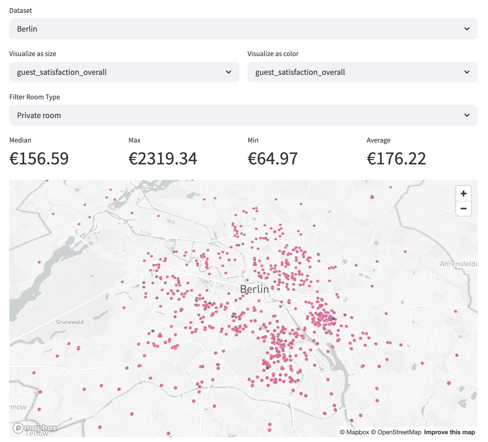

> [!CAUTION]
> We have tried to upload everything to estudijas, however there was a limit of 20 MB.
> The project is also available at: https://github.com/georgelepsaya/ist_5


# Report on Datasets and Processing

## Housing Prices in Germany
**🏠 Apartment rental offers in Germany** dataset from Kaggle: 
https://www.kaggle.com/datasets/corrieaar/apartment-rental-offers-in-germany

The dataset contains rental offers scraped from Germany's biggest real estate online platform - 
Immoscout24. This dataset only contains offers for rental properties. While it was created from 2018 
to 2019, it is still relevant and gives a good idea of the housing situation in different parts of Germany. 

The `.csv` dataset contains columns for most of the important properties, such as:

- Bundesland, City, District, ZIP code, etc.
- Service fee, base and total rent
- Year of construction, condition, information about amenities, etc.
- Living space in m²

### Pre-processing
The strategy for preprocessing is the following:

1. If a variable contains a lot of missing values:
    - We remove it if it doesn't have much relevance for this analysis
    - We keep it to display if it is relevant at any point
    - Rows with missing values for baseRent are dropped.
    - log2 transformation is applied in a new column for the color scheme
    - MinMax scaling is applied for the color column
    - Using IQR we clip outliers, equating them to the lower and upper bounds
2. Remove irrelevant variables:
    - Some of the variables are out of the scope of this analysis
    - "Description" and "Facilities" columns have already been dropped to lower the size of the dataset
3. Remove duplicate variables
    - There are variables with a different name, which contains the same data in the same or worse format.
    These columns should be dropped.

#### Calculating color

First we apply log transformation to normalise the distribution.

```python
df["rent_transf"] = np.log(df["baseRent"] + 1)
```

Then we clip outliers, calculated with an interquantile range and set them to lower 
and upper bound values.

```python
perc25 = df["rent_transf"].quantile(0.25)
perc75 = df["rent_transf"].quantile(0.75)
iqr = perc75 - perc25
lower = perc25 - 1.5 * iqr
upper = perc75 + 1.5 * iqr
df['rent_transf'] = df['rent_transf'].clip(lower=lower, upper=upper)
```

Then apply min-max scaling to get values in range from 0 to 1:

```python
rent_transf = np.array(df['rent_transf']).reshape(-1, 1)
min_val = rent_transf.min()
max_val = rent_transf.max()
rent_transf = (rent_transf - min_val) / (max_val - min_val)
df["rent_transf"] = rent_transf
```

Finally, multiply value of red by the calculated values and get the color metric,
which will be displayed on the map:

```python
df['color'] = df['rent_transf'].apply(lambda x: (int(x * 255), 45, 128, 170))
```


## Exploratory Analysis report

### Rent prices

Below is a map with average rent prices for every zip code in Germany. This mapping was achieved by merging the
initial dataset with the one containing coordinates for zip codes.


It is clear that in Eastern part of Germany prices are generally lower than in Western and Southern part of it. It is
also clear that prices are more expensive around major cities, like Berlin, Hamburg, Munich, etc.

On the web report it's also possible to inspect some states of Germany, e.g. Baden-Württemberg, to see how prices
vary there and see the average and median prices.


We can also explore the median prices of total rent prices in every state.

```python
median_prices = df.groupby("regio1")["totalRent"].median().reset_index()
median_prices = median_prices.sort_values(by="totalRent", ascending=False)
plt.figure(figsize=(10, 6))
plt.bar(median_prices["regio1"], median_prices["totalRent"], color="skyblue")
plt.xlabel("Bundesland")
plt.ylabel("Median Housing Price (€)")
plt.title("Median Housing Prices by Bundesland")
plt.xticks(rotation=45, ha="right")
plt.tight_layout()
plt.show()
```


Finally, we can study a relationship between living space and total rent price. Here a regression line is laid on top
of a hexbin plot showing how many observation there are present for each point on the plot.
The regression line shows a clear trend that the total rent price positively correlates with the living space.

Outliers for `livingSpace` and `totalRent` are already removed before running this code:
```python
df = df.dropna(subset=["livingSpace", "totalRent"])
plt.figure(figsize=(10, 6))
plt.hexbin(
    x=df["livingSpace"],
    y=df["totalRent"],
    gridsize=50,
    cmap="Blues",
    alpha=0.8,
)
plt.colorbar(label="Count of Observations")
plt.xlabel("Living Space (sqm)")
plt.ylabel("Total Rent (€)")
plt.title("Relationship between Living Space and Total Rent (Hexbin Plot)")
x = df["livingSpace"]
y = df["totalRent"]
slope, intercept = np.polyfit(x, y, 1)
x_vals = np.linspace(x.min(), x.max(), 100)
y_vals = slope * x_vals + intercept
plt.plot(x_vals, y_vals, color="darkred", linewidth=2, label="Regression Line")
plt.legend()
plt.tight_layout()
plt.show()
```


## Airbnb rent prices in European cities
This analysis is based on several independent datasets that share the same structure. 

The datasets used are available here:
- https://zenodo.org/records/4446043

For this analysis, only data has been taken for workdays for Barcelona, Amsterdam, Berlin, and Budapest.

The columns are as following:

- `realSum`: the full price of accommodation for two people and two nights in EUR
- `room_type`: the type of the accommodation 
- `room_shared`: dummy variable for shared rooms
- `room_private`: dummy variable for private rooms
- `person_capacity`: the maximum number of guests 
- `host_is_superhost`: dummy variable for superhost status
- `multi`: dummy variable if the listing belongs to hosts with 2-4 offers
- `biz`: dummy variable if the listing belongs to hosts with more than 4 offers
- `cleanliness_rating`: cleanliness rating
- `guest_satisfaction_overall`: overall rating of the listing
- `bedrooms`: number of bedrooms (0 for studios)
- `dist`: distance from city centre in km
- `metro_dist`: distance from nearest metro station in km
- `attr_index`: attraction index of the listing location
- `attr_index_norm`: normalised attraction index (0-100)
- `rest_index`: restaurant index of the listing location
- `attr_index_norm`: normalised restaurant index (0-100)
- `lng`: longitude of the listing location
- `lat`: latitude of the listing location

## Pre-processing & Processing

The `preprocess_dataset` function is responsible for cleaning up the dataset by removing unnecessary columns. 

1. Column Removal: The function uses the DataFrame.drop method to remove the following columns from the dataset:

### Preprocessing in `visualize_dataset`
#### Room Type Filtering

The function allows users to filter the dataset by room_type using a dropdown (`st.selectbox`).
If a specific room type is selected (other than "All"), the dataset is filtered to include only rows where the room_type matches the selected value:
```python
if room_type_filter and room_type_filter != "All":
    df = df[df["room_type"] == room_type_filter]
```

#### Color Metric Calculation:

A new column, `color_metric`, is added to the dataset. 

This column is calculated based on the selected `color_metric_col` (e.g., `realSum` or `guest_satisfaction_overall`).
The color_metric column is created by applying a lambda function to scale the values of the selected column into RGBA color values:
```python
df["color_metric"] = df[color_metric_col].apply(
    lambda x: (
        int(255 / df[color_metric_col].max() * x),  # Red
        100,                                        # Green
        150,                                        # Blue
        255                                         # Transparency
    )
)
```

#### Renaming Columns for Mapping:
The dataset's longitude (lng) and latitude (lat) columns are renamed to lon and lat, respectively, to match the requirements of `st.map`:
```python
df.rename(columns={"lng": "lon", "lat": "lat"})
```

## Examples of Analysis Results



## U.S Border Crossings Data

### Main information

This report explores the U.S. Border Crossing Entry Data from the Bureau of Transportation Statistics.  
It includes monthly data from January 1996 to February 2025 on crossings at the U.S.-Canada and U.S.-Mexico borders.  
The dataset tracks various types of crossings, including vehicles, pedestrians, and trains.  
Raw data is available on this website:  

[U.S. Border Crossing Entry Data](https://catalog.data.gov/dataset/border-crossing-entry-data-683ae)

### Data processing

The data processing and visualization were performed using Python along with three libraries: Streamlit, Pandas, and Plotly Express.

- Streamlit was used to build an interactive and user-friendly web application for exploring the data and presenting the results in real-time. It also allows running the application locally.
- Pandas handled the data extraction, cleaning, transformation, and aggregation manipulations on the dataset.
- Plotly Express was used to create dynamic charts, such as line and bar charts, which helped visualize the processed data.

#### Data extract

The data is downloaded from the website in .csv format.

The extract file contains ten columns, and the report contains data on US border crossings for each month from January 1996 to February 2025 for each border’s ports:

- **Port Name** – Name of the border port.
- **State** – the State where the Port is located.
- **Port Code** – a codified key of the Port.
- **Border** – the border to which the port belongs.
- **Date** – month of the report.
- **Measure** – type of the border crossing (e.g. pedestrian, passenger vehicle).
- **Value** - the number of crossings by the measure per specified month.
- **Latitude** – the latitude location of the port.
- **Longitude** – the longitude location of the port.
- **Point** – the point on the map that consists of longitude and latitude.

#### Pre-processing

1. The **Date** column is converted to the date format and split into 2 different columns:
    - **Month** – the month of the report.
    - **Year** – corresponding year of the report.
2. The last three columns (**Latitude**, **Longitude**, and **Point**) are out of scope of the current research, so they were excluded.

The extraction function code is visible here:  
```python
# Load data
@st.cache_data
def load_data():
    # Data from the catalog.data.gov
    # Border Crossing Entry Data
    # https://catalog.data.gov/dataset/border-crossing-entry-data-683ae
    df = pd.read_csv("data/edgars/Border_Crossing_Entry_Data.csv", parse_dates=["Date"]) # Load file and parse the date colum as a date

    # Pre Processing:
    # Split the date column into YEAR and MONTH
    df['Year'] = df['Date'].dt.year
    df['Month'] = df['Date'].dt.month

    # Drop unwanted columns: LATITUDE, LONGITUDE, POINT
    df = df.drop(columns=["Latitude", "Longitude", "Point"])

    return df

df = load_data()
```

### Dynamic data filtering

The user can adjust dynamically the selection criteria of data with Pickers and a Slider:

- A picker to choose border crossing type.
- A picker to choose the border.
- A slider to choose year range.

```python
# Sidebar with data filters
with st.sidebar:
    st.header("Data Filters")

    # Select type of border crossing e.g. pedestrians, truck, bus
    selected_measure = st.multiselect("Select U.S. border crossing type:", sorted(df["Measure"].unique()), default=["Pedestrians"])

    # Select border (either US-Canada or US-Mexico)
    selected_border = st.multiselect("Select Border:", df["Border"].unique(), default=df["Border"].unique())

    # Choose year range of data selection
    year_range = st.slider("Select Year Range:", int(df["Year"].min()), int(df["Year"].max()), (int(df["Year"].min()), int(df["Year"].max())))

# Apply filters to the data frame
filtered = df[
    (df["Measure"].isin(selected_measure)) & # Selected type of crossing
    (df["Border"].isin(selected_border)) & # Selected border
    (df["Year"] >= year_range[0]) & # Year range from
    (df["Year"] <= year_range[1]) # Year range to
]
```


### Charts

The application creates 2 charts:

1. **Chart for the border crossing over time:**  
   This chart shows total border crossings over time, based on monthly data from the U.S.–Canada and U.S.–Mexico borders.
   
    ```python
    # CHART FOR BORDER CROSSINGS OVER TIME
    # 1) Prepare the data
    # Group the filtered data by date and sum the Value column to get total crossings per date
    time_series = (
        filtered.groupby("Date")["Value"]
        .sum()
        .reset_index()  # Converts the grouped object back into a DataFrame
        .sort_values("Date")  # Ensures the data is in chronological order
    )
    
    # Create a line chart with plotly showing total crossings over time
    fig = px.line(
        time_series,
        x="Date",         # x-axis: Date
        y="Value",        # y-axis: Total number of crossings
        title="Total Crossings Over Time - Chart"
    )
    
    # Render the plotly chart in the streamlit app
    st.plotly_chart(fig, use_container_width=True)
    ```
   

2. **Top 10 ports by total crossings:**  
   This chart displays the Top 10 U.S. ports by total border crossings, based on data from the U.S.–Canada and U.S.–Mexico borders.

   ```python
    # CHART FOR MOST POPULAR CROSSED PORTS
    # 1) Prepare the data
    top_ports = (
        # Group by port name, aggregating sum for the crossings value and capturing the first border value
        filtered.groupby("Port Name")
        .agg({"Value": "sum", "Border": "first"})
        .reset_index()
    )
    
    # Create a new column that combines the Border and Port Name.
    top_ports["Port Label"] = top_ports["Port Name"] + " | " + top_ports["Border"]
    
    # Sort by value in descending order and pick the top 10 ports
    top_ports = top_ports.sort_values("Value", ascending=False).head(10)
    
    # 2) Create a horizontal bar chart using the new Port Label column
    fig2 = px.bar(
        top_ports,
        x="Value",           # Bar length = crossing count
        y="Port Label",      # Use the custom label that has the border prefix
        orientation="h",     # Horizontal bars
        title="Top 10 Ports by Total Crossings - Chart"
    )
    
    # Render the plotly chart in streamlit
    st.plotly_chart(fig2, use_container_width=True)
    ```
   

### Data analysis

#### Sharp Decline in Border Crossings in Early 2020


In February 2020, there is a sharp decline in the number of border crossings at both the US - Mexico and US – Canada borders.  
This dramatic drop aligns with the start of the COVID-19 pandemic and the related travel restrictions implemented by the countries.  
The data shows a gradual recovery beginning in late 2021, with border crossing volumes returning to pre-pandemic levels by July 2022.

#### Long-Term Decline in Peak Border Activity


Border crossings peaks have decreased by around 42% since their peak in July 2000.  
This could be attributed to changes in trade patterns, stricter border policies, and evolving technologies that reduced the need for physical border crossings.

#### Top 7 Ports by Human Crossings Located at the US - Mexico Border


The busiest U.S. border crossings are on the U.S.-Mexico border because of high trade volume, large cities near the border, a lot of tourism, and significant immigration.

People cross daily for work, shopping, vacations, or to visit family, which increases traffic.  
The U.S.-Mexico border also has better infrastructure to handle all this activity.


# Netflix movies datset

**🎬 Netflix Movies and TV Shows Dataset** from Kaggle:    
- https://www.kaggle.com/datasets/shivamb/netflix-shows

This dataset contains detailed information about movies and TV shows available on Netflix until 2021. 
It includes metadata such as the type of content, title, director, cast, country, date added to Netflix, 
release year, duration, content rating, genres (listed_in), and a short description.


The `preprocess_data` function is responsible for preparing and cleaning the dataset to ensure consistent structure and data quality.

It focuses on preserving essential columns like `show_id`, while filling in missing values for less critical fields.

---

### Preprocessing in `preprocess_data`

#### Important Column Handling
The function ensures every entry has a `show_id`, which is critical as a unique identifier.

```python
df.dropna(subset=['show_id'], inplace=True)
```

#### Missing Value Handling
Less critical fields like `director`, `cast`, and `country` are filled with `"Unknown"` to retain rows without key metadata.

```python
df['director'].fillna("Unknown", inplace=True)
df['cast'].fillna("Unknown", inplace=True)
df['country'].fillna("Unknown", inplace=True)
```

#### Date and Type Handling
The `date_added` column is converted to a proper datetime format, and `release_year` is cast to integer where possible.

```python
df['date_added'] = pd.to_datetime(df['date_added'], errors='coerce')
df['release_year'] = df['release_year'].astype(int)
```

#### Default Fallbacks for Descriptive Data
Default strings like `"Untitled"` or `"No Description"` are used where appropriate.

```python
df['title'].fillna("Untitled", inplace=True)
df['description'].fillna("No Description", inplace=True)
```